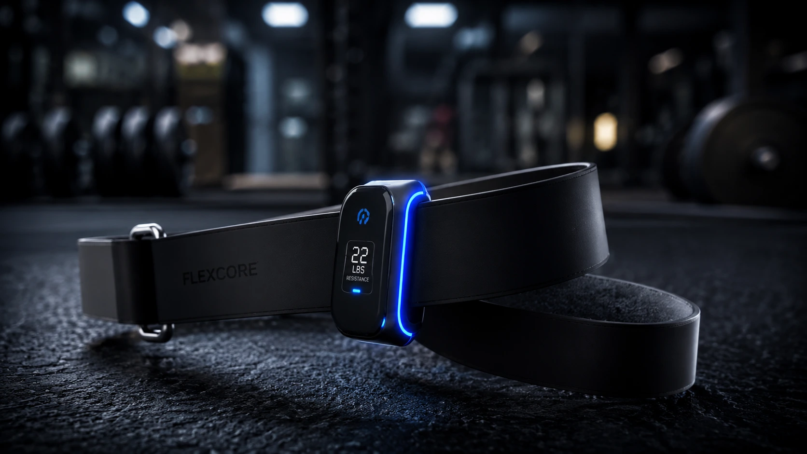

# FlexBand X — Complete Redesign Execution Plan

## Overview

Transform the FlexBand X landing page from a 6-section shared-dependency page into a 19-section standalone premium sports technology experience. From ~167 lines HTML to ~1700+ lines across 3 standalone files.

**Current state:** 167 lines HTML, shared base.css (446 lines), shared app.js (111 lines)
**Target state:** ~550 lines HTML, ~1400 lines CSS, ~350 lines JS — all standalone

---

## 1. CSS Architecture (`style.css`) — ~1400 lines

### 1.1 CSS Variables (`:root`)

```css
:root {
  /* Background system */
  --bg-deep: #050505;
  --bg-carbon: #0D0D0D;
  --bg-graphite: #171717;
  --bg-metallic: #2A2A2A;
  --bg-card: #111111;

  /* Accent system */
  --yellow: #FFD400;
  --yellow-intense: #FFC400;
  --yellow-glow: rgba(255, 212, 0, 0.25);
  --yellow-soft: rgba(255, 212, 0, 0.08);
  --yellow-border: rgba(255, 212, 0, 0.2);

  /* Text */
  --text: #FFFFFF;
  --muted: #A0A0A0;
  --muted-light: #666666;

  /* Borders */
  --border: rgba(255, 255, 255, 0.06);
  --border-hover: rgba(255, 255, 255, 0.12);

  /* Typography */
  --font-heading: 'Sora', -apple-system, sans-serif;
  --font-body: 'Inter', -apple-system, sans-serif;
  --font-mono: 'JetBrains Mono', 'SF Mono', 'Fira Code', monospace;

  /* Sizing */
  --container: min(1180px, 90%);
  --section-p: clamp(80px, 10vw, 140px);
  --radius: 16px;
  --radius-sm: 10px;
  --radius-lg: 24px;

  /* Transitions */
  --ease: cubic-bezier(0.25, 0.46, 0.45, 0.94);
  --ease-out: cubic-bezier(0.22, 1, 0.36, 1);

  /* Legacy compat for configurador */
  --lamp-color: #FFD400;
  --lamp-glow: rgba(255, 212, 0, 0.25);
}
```

### 1.2 CSS File Structure (section order)

| Line Range | Section | Description |
|-----------|---------|-------------|
| 1-80 | Variables | All custom properties |
| 81-120 | Reset | Box-sizing, fonts, scroll, selection |
| 121-160 | Utilities | `.container`, `.reveal`, `.section-tag`, `.section-title`, `.section-sub`, `.btn-*` |
| 161-230 | Header | Fixed sticky navbar, scrolled state, hamburger, mobile menu |
| 231-360 | Hero | Full-screen grid, particles container, parallax image, badge, stats, floating elements |
| 361-420 | Micro Stats | 4-column grid, big number counters, icon + label |
| 421-500 | "No es una banda" | Centered product + floating labels, radial glow |
| 501-570 | Technology | 3-column numbered blocks, horizontal line connectors |
| 571-640 | Exploded View | Product centered, annotation lines, engineering aesthetic |
| 641-730 | Training Modes | 4-card grid with color-coded borders, icon, description |
| 731-810 | App Experience | Phone mockup (CSS-only), dashboard UI elements, screenshot |
| 811-870 | App Interaction | Mode switcher tabs, content panels per mode |
| 871-950 | Scenarios | 4 editorial cards (home/gym/outdoor/recovery), overlay text |
| 951-1040 | Specifications | 7 spec cards with big numbers, grid layout |
| 1041-1120 | Transformation | 3 before/after profiles (beginner/intermediate/advanced), progress bars |
| 1121-1180 | Social Proof | 3 testimonial cards, stars, avatar placeholder |
| 1181-1280 | Pricing/Preventa | Dark + yellow energy, price stack, CTA card, benefits |
| 1281-1320 | Countdown | Premium editorial, big numbers, urgency |
| 1321-1380 | How It Works | 4 steps, connected line, icons |
| 1381-1440 | FAQ | Accordion items, smooth expand/collapse |
| 1441-1480 | Final CTA | Full-width cinematic dark + yellow glow |
| 1481-1520 | Footer | Minimal dark, links, credit |
| 1521-1560 | Mobile Sticky CTA | Fixed bottom bar, z-index 90, yellow gradient |
| 1561-1640 | Particles | `.particle` class, keyframes for float/drift |
| 1641-1700 | Responsive | 3 breakpoints: 900px, 600px, 480px + `prefers-reduced-motion` |

### 1.3 Key CSS Design Patterns

**Yellow Glow System:**
```css
.glow-yellow {
  box-shadow: 0 0 40px rgba(255, 212, 0, 0.15),
              0 0 80px rgba(255, 212, 0, 0.08);
}
.text-glow { text-shadow: 0 0 20px rgba(255, 212, 0, 0.3); }
.border-glow { border-color: rgba(255, 212, 0, 0.25); }
```

**Particles (CSS-only):**
```css
.particles { position: fixed; inset: 0; pointer-events: none; z-index: 0; overflow: hidden; }
.particle {
  position: absolute;
  width: 2px; height: 2px;
  background: var(--yellow);
  border-radius: 50%;
  opacity: 0;
  animation: particle-drift 8s infinite;
}
@keyframes particle-drift {
  0% { opacity: 0; transform: translateY(100vh) scale(0); }
  10% { opacity: 0.6; }
  90% { opacity: 0.6; }
  100% { opacity: 0; transform: translateY(-10vh) scale(1); }
}
```

**Phone Mockup (CSS-only):**
```css
.phone-frame {
  width: 280px; height: 560px;
  background: var(--bg-deep);
  border: 2px solid var(--border);
  border-radius: 36px;
  position: relative;
  overflow: hidden;
  box-shadow: 0 20px 60px rgba(0,0,0,0.5);
}
.phone-notch {
  position: absolute; top: 0; left: 50%; transform: translateX(-50%);
  width: 120px; height: 24px;
  background: var(--bg-deep);
  border-radius: 0 0 16px 16px;
  z-index: 2;
}
.phone-screen {
  position: absolute; inset: 8px;
  border-radius: 28px;
  overflow: hidden;
  background: var(--bg-carbon);
}
```

**Count-up Numbers:**
```css
.stat-big {
  font-family: var(--font-mono);
  font-weight: 700;
  font-size: clamp(2.4rem, 5vw, 3.8rem);
  color: var(--yellow);
  line-height: 1;
}
.stat-unit {
  font-size: 0.5em;
  color: var(--muted);
  font-weight: 400;
}
```

**FAQ Accordion:**
```css
.faq-item { border-bottom: 1px solid var(--border); }
.faq-question {
  width: 100%; display: flex; justify-content: space-between; align-items: center;
  padding: 20px 0; font-size: 1.05rem; font-weight: 600; color: var(--text);
  background: none; border: none; cursor: pointer; text-align: left;
}
.faq-answer {
  max-height: 0; overflow: hidden;
  transition: max-height 0.4s var(--ease), padding 0.4s var(--ease);
  color: var(--muted); font-size: 0.95rem; line-height: 1.7;
}
.faq-item.active .faq-answer { max-height: 300px; padding-bottom: 20px; }
.faq-chevron { transition: transform 0.3s; }
.faq-item.active .faq-chevron { transform: rotate(180deg); }
```

**How It Works Line:**
```css
.steps-line {
  position: absolute; top: 40px; left: 15%; right: 15%;
  height: 2px;
  background: linear-gradient(90deg, transparent, var(--yellow-border), var(--yellow), var(--yellow-border), transparent);
}
.step-number {
  width: 56px; height: 56px;
  border-radius: 50%;
  background: var(--bg-carbon);
  border: 2px solid var(--yellow);
  display: grid; place-items: center;
  font-family: var(--font-mono);
  font-weight: 700;
  color: var(--yellow);
  font-size: 1.2rem;
  position: relative; z-index: 2;
}
```

### 1.4 Responsive Breakpoints

**900px (tablet):**
- All 2-column grids → 1 column
- Nav links → hamburger menu
- Hero visual → order -1 (above text)
- Section padding: 70px 0
- Center text + buttons

**600px (large mobile):**
- Phone mockup scale down to 240px width
- Spec cards → 2-column grid
- Training mode cards → 2x2 grid
- Scenario cards → 1 column
- Countdown numbers → smaller

**480px (small mobile):**
- All grids → single column
- Phone mockup → 220px
- Hero title → clamp minimum
- Mobile sticky CTA → visible
- FAQ padding → reduced

---

## 2. JavaScript Architecture (`script.js`) — ~350 lines

### 2.1 Features List

| Feature | Lines | Description |
|---------|-------|-------------|
| Header Scroll | ~15 | Adds `.scrolled` class at scrollY > 60px. Transitions bg from transparent to `rgba(5,5,5,0.95)` |
| Mobile Menu | ~25 | Hamburger toggle, close on link click, body overflow lock |
| Smooth Scroll | ~12 | All `a[href^="#"]` links smooth-scroll with offset for fixed header |
| Particles | ~30 | Creates 30 `.particle` elements with randomized position, delay, duration via inline styles |
| Hero Parallax | ~12 | `scrollY < 800` → translates hero-img and hero-glow at different rates (0.04 vs 0.02) |
| Count-Up Numbers | ~40 | IntersectionObserver triggers. Animates from 0 to target over 2s using `requestAnimationFrame`. Handles decimals, units, special chars (±, h, kg, IP67) |
| Scroll Reveal | ~15 | IntersectionObserver on all `.reveal` targets. Adds `.visible` class at threshold 0.12 |
| Configurador | ~35 | Mode switcher (Fuerza/Cardio/Flex/Rehab). Changes glow color, product filter, mode name, and phone content |
| App Demo | ~25 | 4 mode tabs that swap phone screen content (dashboard data) |
| FAQ Accordion | ~20 | Click handler toggles `.active` on `.faq-item`. Only one open at a time |
| Countdown | ~25 | Same pattern as lumisphere: `data-days` attribute, `requestAnimationFrame` tick loop |
| Mobile Sticky CTA | ~10 | Shows/hides based on scroll position (below hero = visible) |

### 2.2 JS Structure (IIFE wrapping, all features)

```javascript
(function () {
  "use strict";

  /* ---------- Constants ---------- */
  var SELECTORS = { ... };

  /* ---------- Header Scroll ---------- */
  // ...

  /* ---------- Mobile Menu ---------- */
  // ...

  /* ---------- Smooth Scroll ---------- */
  // ...

  /* ---------- Particles ---------- */
  // ...

  /* ---------- Hero Parallax ---------- */
  // ...

  /* ---------- Count-Up Numbers ---------- */
  // ...

  /* ---------- Scroll Reveal ---------- */
  // ...

  /* ---------- Training Mode Configurator ---------- */
  // ...

  /* ---------- App Demo ---------- */
  // ...

  /* ---------- FAQ Accordion ---------- */
  // ...

  /* ---------- Countdown ---------- */
  // ...

  /* ---------- Mobile Sticky CTA ---------- */
  // ...

})();
```

### 2.3 Count-Up Implementation (critical feature)

```javascript
function countUp(el) {
  var target = el.dataset.target;       // e.g. "0.1", "20", "35", "67"
  var prefix = el.dataset.prefix || ""; // e.g. "±"
  var suffix = el.dataset.suffix || ""; // e.g. " KG", "H", ""
  var isDecimal = target.indexOf(".") !== -1;
  var numTarget = parseFloat(target);
  var duration = 2000;
  var start = performance.now();

  function frame(now) {
    var elapsed = now - start;
    var progress = Math.min(elapsed / duration, 1);
    var eased = 1 - Math.pow(1 - progress, 3); // easeOutCubic
    var current = numTarget * eased;

    if (isDecimal) {
      el.textContent = prefix + current.toFixed(1) + suffix;
    } else {
      el.textContent = prefix + Math.round(current) + suffix;
    }

    if (progress < 1) requestAnimationFrame(frame);
  }
  requestAnimationFrame(frame);
}
```

### 2.4 Particles Implementation

```javascript
function createParticles() {
  var container = document.getElementById("particles");
  if (!container) return;
  for (var i = 0; i < 30; i++) {
    var p = document.createElement("div");
    p.className = "particle";
    p.style.left = Math.random() * 100 + "%";
    p.style.animationDelay = Math.random() * 8 + "s";
    p.style.animationDuration = 6 + Math.random() * 6 + "s";
    p.style.width = p.style.height = (1 + Math.random() * 2) + "px";
    container.appendChild(p);
  }
}
```

### 2.5 Configurador Data (4 modes)

```javascript
var modes = [
  {
    name: "Fuerza",
    range: "25–35 KG",
    color: "#FFD400",
    glow: "rgba(255,212,0,0.55)",
    filter: "drop-shadow(0 0 30px rgba(255,212,0,0.7))",
    desc: "Máxima resistencia para ganar fuerza",
    appData: { reps: "12", sets: "4", load: "32 KG", volume: "1,536 KG" }
  },
  {
    name: "Cardio",
    range: "10–15 KG",
    color: "#FF6B35",
    glow: "rgba(255,107,53,0.55)",
    filter: "drop-shadow(0 0 30px rgba(255,107,53,0.7))",
    desc: "Ritmo alto para quemar calorías",
    appData: { reps: "20", sets: "3", load: "12 KG", volume: "720 KG" }
  },
  {
    name: "Flexibilidad",
    range: "5–10 KG",
    color: "#00D4AA",
    glow: "rgba(0,212,170,0.55)",
    filter: "drop-shadow(0 0 30px rgba(0,212,170,0.7))",
    desc: "Estiramiento activo y movilidad",
    appData: { reps: "15", sets: "2", load: "8 KG", volume: "240 KG" }
  },
  {
    name: "Rehabilitación",
    range: "5–8 KG",
    color: "#8B5CF6",
    glow: "rgba(139,92,246,0.55)",
    filter: "drop-shadow(0 0 30px rgba(139,92,246,0.7))",
    desc: "Recuperación y prevención de lesiones",
    appData: { reps: "10", sets: "3", load: "6 KG", volume: "180 KG" }
  }
];
```

---

## 3. HTML Structure (`index.html`) — ~550 lines

### 3.1 Head Section

```html
<!DOCTYPE html>
<html lang="es">
<head>
  <meta charset="UTF-8">
  <meta name="viewport" content="width=device-width, initial-scale=1.0">
  <title>FlexBand X — Banda de Resistencia Inteligente con Sensor</title>
  <meta name="description" content="Entrena más inteligente con sensor de fuerza en tiempo real, contador de reps y app con rutinas personalizadas.">
  <link rel="preconnect" href="https://fonts.googleapis.com">
  <link rel="preconnect" href="https://fonts.gstatic.com" crossorigin>
  <link href="https://fonts.googleapis.com/css2?family=Sora:wght@400;600;700;800&family=Inter:wght@400;500;600&family=JetBrains+Mono:wght@400;700&display=swap" rel="stylesheet">
  <link rel="stylesheet" href="style.css">
</head>
```

### 3.2 Section-by-Section HTML Breakdown

#### Section 1: Header (lines ~30-55)
```html
<header id="header">
  <div class="container header-inner">
    <a href="/" class="logo">Flex<span>Band</span> X</a>
    <nav class="nav-links">
      <a href="#tech">Tecnología</a>
      <a href="#modes">Entrenamiento</a>
      <a href="#app-section">App</a>
      <a href="#specs">Specs</a>
      <a href="#pricing" class="btn-header">Reservar</a>
    </nav>
    <button class="hamburger" aria-label="Menú">
      <span></span><span></span><span></span>
    </button>
  </div>
</header>
<div class="mobile-menu" id="mobileMenu">
  <button class="mobile-close" aria-label="Cerrar">&times;</button>
  <a href="#tech">Tecnología</a>
  <a href="#modes">Entrenamiento</a>
  <a href="#app-section">App</a>
  <a href="#specs">Specs</a>
  <a href="#pricing" class="btn-header">Reservar ahora</a>
</div>
```

**CSS classes:** `.header-inner`, `.logo span` (yellow), `.btn-header`, `.hamburger`, `.mobile-menu`, `.mobile-close`

#### Section 2: Hero (lines ~57-95)
```html
<section class="hero" id="hero">
  <div class="particles" id="particles"></div>
  <div class="hero-glow" id="heroGlow"></div>
  <div class="container hero-grid">
    <div class="hero-text">
      <span class="badge-preventa">Preventa — 20% OFF</span>
      <h1 class="hero-title">Flex<span>Band</span> X</h1>
      <p class="hero-subtitle">Tu fuerza, medida con precisión.</p>
      <p class="hero-desc">
        Banda de resistencia inteligente con sensor de fuerza en tiempo real.
        Contador automático de repeticiones, corrección de forma y app con
        rutinas personalizadas.
      </p>
      <div class="hero-buttons">
        <a href="#pricing" class="btn btn-primary">Reservar con 20% OFF</a>
        <a href="#modes" class="btn btn-secondary">Ver modos de entrenamiento</a>
      </div>
      <div class="hero-stats">
        <div class="hero-stat"><span class="hero-stat-value">±0.1</span><span class="hero-stat-unit">KG</span><span class="hero-stat-label">Precisión</span></div>
        <div class="hero-stat"><span class="hero-stat-value">20</span><span class="hero-stat-unit">H</span><span class="hero-stat-label">Batería</span></div>
        <div class="hero-stat"><span class="hero-stat-value">IP67</span><span class="hero-stat-label">Resistente</span></div>
      </div>
    </div>
    <div class="hero-visual">
      <div class="lamp-glow" id="lampGlow"></div>
      
      <div class="hero-float-badge">
        <svg><!-- sensor icon 24x24 --></svg>
        <span>Sensor en tiempo real</span>
      </div>
    </div>
  </div>
</section>
```

**Image usage:** `flexband-x.webp` centered, large, with yellow drop-shadow glow
**Particles:** 30 CSS-animated dots, positioned by JS

#### Section 3: Micro Stats (lines ~97-120)
```html
<section class="micro-stats" id="stats">
  <div class="container">
    <div class="stats-grid">
      <div class="stat-block">
        <div class="stat-big"><span class="counter" data-target="0.1" data-prefix="±" data-suffix=" KG">0</span></div>
        <div class="stat-desc">Precisión del sensor de carga</div>
      </div>
      <div class="stat-block">
        <div class="stat-big"><span class="counter" data-target="20" data-suffix="H">0</span></div>
        <div class="stat-desc">Horas de batería continua</div>
      </div>
      <div class="stat-block">
        <div class="stat-big"><span class="counter" data-target="35" data-prefix="5-" data-suffix=" KG">0</span></div>
        <div class="stat-desc">Rango de resistencia</div>
      </div>
      <div class="stat-block">
        <div class="stat-big">IP<span class="counter" data-target="67" data-suffix="">0</span></div>
        <div class="stat-desc">Certificación de resistencia</div>
      </div>
    </div>
  </div>
</section>
```

**Note:** The IP67 counter is tricky — the `IP` prefix is in the HTML, only `67` is animated. The `5-35 KG` uses a prefix `5-` and suffix ` KG` around the animated `35`.

#### Section 4: "No es una banda" (lines ~122-150)
```html
<section class="narrative" id="narrative">
  <div class="container">
    <div class="narrative-content">
      <span class="section-tag">Más que resistencia</span>
      <h2 class="section-title">No es una banda.<br>Es un sistema de entrenamiento.</h2>
      <p class="section-sub">Un sensor de precisión + inteligencia artificial + tu cuerpo. Eso es FlexBand X.</p>
    </div>
    <div class="narrative-product">
      <div class="narrative-glow"></div>
      
      <!-- Floating labels positioned via CSS -->
      <div class="float-label float-label-1">
        <svg><!-- icon --></svg>
        <span>Sensor ±0.1 KG</span>
      </div>
      <div class="float-label float-label-2">
        <svg><!-- icon --></svg>
        <span>Bluetooth 5.0</span>
      </div>
      <div class="float-label float-label-3">
        <svg><!-- icon --></svg>
        <span>IP67 Lavable</span>
      </div>
    </div>
  </div>
</section>
```

**Image usage:** Centered product, smaller, with 3 floating labels connected by thin lines (CSS `::before` pseudo-elements)

#### Section 5: Technology (lines ~152-185)
```html
<section class="technology" id="tech">
  <div class="container">
    <span class="section-tag">Tecnología</span>
    <h2 class="section-title">Ingeniería de alto rendimiento</h2>
    <p class="section-sub">Tres sistemas trabajando juntos para transformar cada repetición en datos accionables.</p>
    <div class="tech-grid">
      <div class="tech-block">
        <div class="tech-number">01</div>
        <div class="tech-icon">
          <svg><!-- sensor icon 48x48 --></svg>
        </div>
        <h3>Celda de Carga</h3>
        <p>Sensor de fuerza con precisión de ±0.1kg. Mide cada repetición en tiempo real sin calibración manual.</p>
      </div>
      <div class="tech-block">
        <div class="tech-number">02</div>
        <div class="tech-icon">
          <svg><!-- bluetooth icon 48x48 --></svg>
        </div>
        <h3>Bluetooth 5.0</h3>
        <p>Conexión estable hasta 15 metros. Transmisión de datos continua sin interrupciones durante el entrenamiento.</p>
      </div>
      <div class="tech-block">
        <div class="tech-number">03</div>
        <div class="tech-icon">
          <svg><!-- battery icon 48x48 --></svg>
        </div>
        <h3>3000 mAh</h3>
        <p>Batería de larga duración con 20 horas de uso continuo. Carga completa en 2 horas via USB-C.</p>
      </div>
    </div>
  </div>
</section>
```

**CSS:** `tech-grid` uses CSS grid, 3 columns. `tech-number` is a large outlined number behind each block. `tech-icon` uses SVG icons.

#### Section 6: Product Exploded View (lines ~187-225)
```html
<section class="exploded" id="exploded">
  <div class="container">
    <span class="section-tag">Diseño</span>
    <h2 class="section-title">Cada detalle, pensado para rendir</h2>
    <div class="exploded-view">
      <div class="exploded-product">
        
      </div>
      <!-- Annotation lines + labels -->
      <div class="annotation annotation-1">
        <div class="annotation-line"></div>
        <div class="annotation-label">
          <strong>Material TPE</strong>
          <span>Elastómero termoplástico grado deportivo</span>
        </div>
      </div>
      <div class="annotation annotation-2">
        <div class="annotation-line"></div>
        <div class="annotation-label">
          <strong>Sensor integrado</strong>
          <span>Celda de carga sellada IP67</span>
        </div>
      </div>
      <div class="annotation annotation-3">
        <div class="annotation-line"></div>
        <div class="annotation-label">
          <strong>Módulo Bluetooth</strong>
          <span>Nordic nRF52, bajo consumo</span>
        </div>
      </div>
      <div class="annotation annotation-4">
        <div class="annotation-line"></div>
        <div class="annotation-label">
          <strong>Batería 3000mAh</strong>
          <span>20h de uso, carga USB-C</span>
        </div>
      </div>
    </div>
  </div>
</section>
```

**Image usage:** Horizontal product image, annotations positioned absolutely around it with CSS lines connecting to the product. Engineering diagram aesthetic.

#### Section 7: Training Modes (lines ~227-270)
```html
<section class="modes" id="modes">
  <div class="container">
    <span class="section-tag">Entrenamiento</span>
    <h2 class="section-title">4 modos. Un solo dispositivo.</h2>
    <p class="section-sub">FlexBand X adapta la resistencia y el tracking a cada tipo de entrenamiento.</p>
    <div class="modes-grid">
      <div class="mode-card" data-mode="fuerza">
        <div class="mode-icon">
          <svg><!-- dumbbell icon 40x40 --></svg>
        </div>
        <h3>Fuerza</h3>
        <div class="mode-range">25–35 KG</div>
        <p>Máxima resistencia para ganar masa y fuerza muscular.</p>
      </div>
      <div class="mode-card" data-mode="cardio">
        <div class="mode-icon">
          <svg><!-- heart-pulse icon 40x40 --></svg>
        </div>
        <h3>Cardio</h3>
        <div class="mode-range">10–15 KG</div>
        <p>Ritmo alto para quemar calorías y mejorar resistencia.</p>
      </div>
      <div class="mode-card" data-mode="flex">
        <div class="mode-icon">
          <svg><!-- stretch icon 40x40 --></svg>
        </div>
        <h3>Flexibilidad</h3>
        <div class="mode-range">5–10 KG</div>
        <p>Estiramiento activo y mejora de movilidad articular.</p>
      </div>
      <div class="mode-card" data-mode="rehab">
        <div class="mode-icon">
          <svg><!-- medical icon 40x40 --></svg>
        </div>
        <h3>Rehabilitación</h3>
        <div class="mode-range">5–8 KG</div>
        <p>Recuperación controlada y prevención de lesiones.</p>
      </div>
    </div>
  </div>
</section>
```

#### Section 8: App Experience (lines ~272-330)
```html
<section class="app-section" id="app-section">
  <div class="container app-grid">
    <div class="app-text">
      <span class="section-tag">App gratuita</span>
      <h2 class="section-title">Todo tu entrenamiento en una pantalla</h2>
      <p class="section-sub">Reps, series, volumen, progreso y rutinas personalizadas — todo sincronizado por Bluetooth en tiempo real.</p>
      <ul class="app-features">
        <li>
          <svg><!-- check icon --></svg>
          <span>Dashboard en tiempo real con métricas de cada serie</span>
        </li>
        <li>
          <svg><!-- check icon --></svg>
          <span>Rutinas personalizadas por nivel y objetivo</span>
        </li>
        <li>
          <svg><!-- check icon --></svg>
          <span>Historial de entrenamientos con gráficas de progreso</span>
        </li>
        <li>
          <svg><!-- check icon --></svg>
          <span>Alertas de corrección de forma en tiempo real</span>
        </li>
      </ul>
      <div class="app-badges">
        <div class="app-store-badge">iOS 14+</div>
        <div class="app-store-badge">Android 10+</div>
      </div>
    </div>
    <div class="app-visual">
      <div class="phone-frame">
        <div class="phone-notch"></div>
        <div class="phone-screen" id="phoneScreen">
          <!-- Dashboard UI -->
          <div class="dash-header">
            <div class="dash-greeting">Buenas tardes</div>
            <div class="dash-date">Hoy</div>
          </div>
          <div class="dash-metrics">
            <div class="dash-metric">
              <span class="dash-value" id="dashReps">12</span>
              <span class="dash-label">Reps</span>
            </div>
            <div class="dash-metric">
              <span class="dash-value" id="dashSets">4</span>
              <span class="dash-label">Series</span>
            </div>
            <div class="dash-metric accent">
              <span class="dash-value" id="dashLoad">32 KG</span>
              <span class="dash-label">Carga</span>
            </div>
          </div>
          <div class="dash-chart">
            <div class="dash-bar" style="height:60%"></div>
            <div class="dash-bar" style="height:80%"></div>
            <div class="dash-bar active" style="height:100%"></div>
            <div class="dash-bar" style="height:70%"></div>
            <div class="dash-bar" style="height:45%"></div>
          </div>
          <div class="dash-footer">
            <span class="dash-volume" id="dashVolume">1,536 KG</span>
            <span class="dash-volume-label">Volumen total</span>
          </div>
        </div>
      </div>
    </div>
  </div>
</section>
```

#### Section 9: App Interaction (lines ~332-375)
```html
<section class="app-interaction" id="app-interaction">
  <div class="container">
    <span class="section-tag">Interactivo</span>
    <h2 class="section-title">Selecciona un modo y mira la app en acción</h2>
    <div class="mode-switcher">
      <button class="mode-tab active" data-index="0">Fuerza</button>
      <button class="mode-tab" data-index="1">Cardio</button>
      <button class="mode-tab" data-index="2">Flexibilidad</button>
      <button class="mode-tab" data-index="3">Rehabilitación</button>
    </div>
    <div class="interaction-preview">
      <div class="phone-frame phone-frame-lg">
        <div class="phone-notch"></div>
        <div class="phone-screen" id="interactionScreen">
          <!-- Dynamically filled by JS -->
        </div>
      </div>
    </div>
  </div>
</section>
```

**JS behavior:** Clicking a mode-tab swaps the phone screen content (reps, sets, load, volume, chart bar heights, color accent).

#### Section 10: Scenarios (lines ~377-415)
```html
<section class="scenarios" id="scenarios">
  <div class="container">
    <span class="section-tag">Estilos de vida</span>
    <h2 class="section-title">Entrena donde quieras</h2>
    <div class="scenarios-grid">
      <div class="scenario-card">
        <div class="scenario-img-wrap">
          
        </div>
        <div class="scenario-overlay">
          <h3>En casa</h3>
          <p>Tu gimnasio personal en 120cm.</p>
        </div>
      </div>
      <div class="scenario-card">
        <div class="scenario-img-wrap">
          
        </div>
        <div class="scenario-overlay">
          <h3>En el gym</h3>
          <p>Complementa tus rutinas con datos precisos.</p>
        </div>
      </div>
      <div class="scenario-card">
        <div class="scenario-img-wrap">
          
        </div>
        <div class="scenario-overlay">
          <h3>Al aire libre</h3>
          <p>Resistente al agua IP67, sin límites.</p>
        </div>
      </div>
      <div class="scenario-card">
        <div class="scenario-img-wrap">
          
        </div>
        <div class="scenario-overlay">
          <h3>Recuperación</h3>
          <p>Rehabilitación guiada con tracking preciso.</p>
        </div>
      </div>
    </div>
  </div>
</section>
```

**Image strategy:** Same `flexband-x.webp` 4 times with different `object-position`, `filter`, and `brightness` to create 4 distinct visual treatments. `object-fit: cover` + `width/height: 100%` on the card.

#### Section 11: Specifications (lines ~417-475)
```html
<section class="specs" id="specs">
  <div class="container">
    <span class="section-tag">Especificaciones</span>
    <h2 class="section-title">Los números hablan</h2>
    <div class="specs-grid">
      <div class="spec-card">
        <div class="spec-value">±0.1</div>
        <div class="spec-unit">KG</div>
        <div class="spec-label">Precisión del sensor</div>
      </div>
      <div class="spec-card">
        <div class="spec-value">3000</div>
        <div class="spec-unit">mAh</div>
        <div class="spec-label">Capacidad de batería</div>
      </div>
      <div class="spec-card">
        <div class="spec-value">20</div>
        <div class="spec-unit">horas</div>
        <div class="spec-label">Uso continuo</div>
      </div>
      <div class="spec-card">
        <div class="spec-value">15</div>
        <div class="spec-unit">metros</div>
        <div class="spec-label">Alcance Bluetooth</div>
      </div>
      <div class="spec-card">
        <div class="spec-value">120</div>
        <div class="spec-unit">× 5 cm</div>
        <div class="spec-label">Dimensiones</div>
      </div>
      <div class="spec-card">
        <div class="spec-value">180</div>
        <div class="spec-unit">gramos</div>
        <div class="spec-label">Peso</div>
      </div>
      <div class="spec-card accent-card">
        <div class="spec-value">IP67</div>
        <div class="spec-unit"></div>
        <div class="spec-label">Protección contra agua y polvo</div>
      </div>
    </div>
  </div>
</section>
```

**CSS:** `spec-card` dark cards with border, `.spec-value` uses `--font-mono` for the sporty number look, `.accent-card` has yellow border.

#### Section 12: Transformation (lines ~477-520)
```html
<section class="transformation" id="transformation">
  <div class="container">
    <span class="section-tag">Resultados</span>
    <h2 class="section-title">De principiante a atleta</h2>
    <p class="section-sub">FlexBand X se adapta a tu nivel y escala contigo. Estos son perfiles de ejemplo de lo que puedes lograr.</p>
    <div class="transform-grid">
      <div class="transform-card">
        <div class="transform-level">Principiante</div>
        <div class="transform-icon">
          <svg><!-- beginner icon --></svg>
        </div>
        <div class="transform-bar">
          <div class="transform-fill" style="width:33%"></div>
        </div>
        <div class="transform-detail">
          <span>Semanas 1–4</span>
          <span>5–10 KG</span>
        </div>
        <p class="transform-desc">Construye base de fuerza con resistencia ligera. Aprenda forma correcta con alertas de la app.</p>
      </div>
      <div class="transform-card">
        <div class="transform-level">Intermedio</div>
        <div class="transform-icon">
          <svg><!-- intermediate icon --></svg>
        </div>
        <div class="transform-bar">
          <div class="transform-fill" style="width:66%"></div>
        </div>
        <div class="transform-detail">
          <span>Meses 2–3</span>
          <span>15–25 KG</span>
        </div>
        <p class="transform-desc">Incrementa carga progresivamente. Tracking de volumen revela patrones de mejora.</p>
      </div>
      <div class="transform-card">
        <div class="transform-level">Avanzado</div>
        <div class="transform-icon">
          <svg><!-- advanced icon --></svg>
        </div>
        <div class="transform-bar">
          <div class="transform-fill" style="width:100%"></div>
        </div>
        <div class="transform-detail">
          <span>Meses 4+</span>
          <span>25–35 KG</span>
        </div>
        <p class="transform-desc">Máxima resistencia. Periodización inteligente con datos históricos de rendimiento.</p>
      </div>
    </div>
  </div>
</section>
```

**Note:** All three cards say "perfiles de ejemplo" — no invented results or certifications.

#### Section 13: Social Proof (lines ~522-565)
```html
<section class="social-proof" id="social">
  <div class="container">
    <span class="section-tag">Comunidad</span>
    <h2 class="section-title">Lo que dice la gente</h2>
    <p class="section-sub">Testimonios de usuarios beta. Resultados individuales pueden variar.</p>
    <div class="testimonials-grid">
      <div class="testimonial-card">
        <div class="testimonial-stars">
          <svg><!-- 5 star icons --></svg>
        </div>
        <p class="testimonial-text">"El sensor de fuerza cambió cómo entreno. Puedo ver exactamente cuánto estoy levantando en cada serie."</p>
        <div class="testimonial-author">
          <div class="testimonial-avatar"><!-- CSS circle --></div>
          <div>
            <div class="testimonial-name">Carlos M.</div>
            <div class="testimonial-role">Usuario beta — Bogotá</div>
          </div>
        </div>
      </div>
      <div class="testimonial-card">
        <div class="testimonial-stars"><!-- 5 stars --></div>
        <p class="testimonial-text">"La app es increíble. Me gusta poder seguir mi progreso semana a semana y ver los gráficos de volumen."</p>
        <div class="testimonial-author">
          <div class="testimonial-avatar"></div>
          <div>
            <div class="testimonial-name">Laura G.</div>
            <div class="testimonial-role">Usuario beta — Medellín</div>
          </div>
        </div>
      </div>
      <div class="testimonial-card">
        <div class="testimonial-stars"><!-- 5 stars --></div>
        <p class="testimonial-text">"Perfecta para rehabilitación. La precisión del sensor me da confianza de no sobrepasar los límites."</p>
        <div class="testimonial-author">
          <div class="testimonial-avatar"></div>
          <div>
            <div class="testimonial-name">Andrés R.</div>
            <div class="testimonial-role">Usuario beta — Cali</div>
          </div>
        </div>
      </div>
    </div>
  </div>
</section>
```

**Disclaimer:** "Testimonios de usuarios beta. Resultados individuales pueden variar." — prominent and visible.

#### Section 14: Pricing/Preventa (lines ~567-625)
```html
<section class="pricing" id="pricing">
  <div class="pricing-glow"></div>
  <div class="container pricing-grid">
    <div class="pricing-info">
      <span class="section-tag">Oferta de preventa</span>
      <h2 class="section-title">Tu gimnasio inteligente</h2>
      <p class="section-sub">Preventa exclusiva con 20% de descuento. Solo por tiempo limitado.</p>
      <div class="price-stack">
        <span class="price-before">$129.000</span>
        <span class="price-now">$99.000</span>
        <span class="price-save">Ahorras $30.000</span>
      </div>
      <ul class="pricing-benefits">
        <li>
          <svg><!-- truck icon --></svg>
          Envío gratis a toda Colombia
        </li>
        <li>
          <svg><!-- shield icon --></svg>
          30 días de garantía — reembolso completo
        </li>
        <li>
          <svg><!-- phone icon --></svg>
          App gratuita incluida
        </li>
        <li>
          <svg><!-- package icon --></svg>
          FlexBand X + accesorios incluidos
        </li>
      </ul>
    </div>
    <div class="pricing-cta-card">
      <div class="pricing-cta-inner">
        <div class="pricing-countdown-label">La oferta termina en:</div>
        <div class="countdown" id="countdown" data-days="4">
          <div class="cd-item"><span class="cd-num" id="cd-days">00</span><span class="cd-label">Días</span></div>
          <div class="cd-item"><span class="cd-num" id="cd-hours">00</span><span class="cd-label">Horas</span></div>
          <div class="cd-item"><span class="cd-num" id="cd-mins">00</span><span class="cd-label">Min</span></div>
          <div class="cd-item"><span class="cd-num" id="cd-secs">00</span><span class="cd-label">Seg</span></div>
        </div>
        <a href="#" class="btn btn-cta">Reservar FlexBand X — $99.000</a>
        <p class="cta-note">Sin riesgo — reembolso completo en 30 días</p>
      </div>
    </div>
  </div>
</section>
```

#### Section 15: How It Works (lines ~627-665)
```html
<section class="how-it-works" id="how">
  <div class="container">
    <span class="section-tag">Cómo funciona</span>
    <h2 class="section-title">4 pasos para empezar</h2>
    <div class="steps-container">
      <div class="steps-line"></div>
      <div class="steps-grid">
        <div class="step">
          <div class="step-number">1</div>
          <h3>Recibe tu FlexBand X</h3>
          <p>Envío gratis a toda Colombia. Empaque premium con todo incluido.</p>
        </div>
        <div class="step">
          <div class="step-number">2</div>
          <h3>Descarga la app</h3>
          <p>iOS 14+ o Android 10+. Parear por Bluetooth en 30 segundos.</p>
        </div>
        <div class="step">
          <div class="step-number">3</div>
          <h3>Selecciona tu modo</h3>
          <p>Fuerza, cardio, flexibilidad o rehabilitación. La app adapta las métricas.</p>
        </div>
        <div class="step">
          <div class="step-number">4</div>
          <h3>Entrena y progresa</h3>
          <p>Reps automáticas, tracking de volumen, gráficas de evolución.</p>
        </div>
      </div>
    </div>
  </div>
</section>
```

**CSS:** Horizontal line connecting all 4 step numbers (absolute positioned `::before` on the container). Each step has its `step-number` circle centered above it.

#### Section 16: FAQ (lines ~667-730)
```html
<section class="faq" id="faq">
  <div class="container">
    <span class="section-tag">Preguntas frecuentes</span>
    <h2 class="section-title">Todo lo que necesitas saber</h2>
    <div class="faq-list">
      <div class="faq-item">
        <button class="faq-question">
          <span>¿Cómo mide la resistencia el sensor?</span>
          <svg class="faq-chevron"><!-- chevron icon --></svg>
        </button>
        <div class="faq-answer">
          <p>FlexBand X incorpora una celda de carga integrada que mide la fuerza aplicada en cada repetición con una precisión de ±0.1 kg. Los datos se transmiten por Bluetooth 5.0 a la app en tiempo real.</p>
        </div>
      </div>
      <div class="faq-item">
        <button class="faq-question">
          <span>¿Cuánto dura la batería?</span>
          <svg class="faq-chevron"><!-- chevron icon --></svg>
        </button>
        <div class="faq-answer">
          <p>Con una batería de 3000 mAh, FlexBand X ofrece hasta 20 horas de uso continuo. Se carga completamente en aproximadamente 2 horas con cualquier cargador USB-C.</p>
        </div>
      </div>
      <div class="faq-item">
        <button class="faq-question">
          <span>¿Es resistente al agua?</span>
          <svg class="faq-chevron"><!-- chevron icon --></svg>
        </button>
        <div class="faq-answer">
          <p>Sí, tiene certificación IP67. Puedes entrenar con ella bajo lluvia y lavarla bajo agua sin problemas. El módulo electrónico está completamente sellado.</p>
        </div>
      </div>
      <div class="faq-item">
        <button class="faq-question">
          <span>¿Necesito una suscripción para la app?</span>
          <svg class="faq-chevron"><!-- chevron icon --></svg>
        </button>
        <div class="faq-answer">
          <p>No. La app es gratuita y incluida. No hay costos ocultos, suscripciones ni compras dentro de la app. Todas las funciones están disponibles desde el primer día.</p>
        </div>
      </div>
      <div class="faq-item">
        <button class="faq-question">
          <span>¿Funciona con mi celular?</span>
          <svg class="faq-chevron"><!-- chevron icon --></svg>
        </button>
        <div class="faq-answer">
          <p>La app es compatible con iOS 14+ (iPhone) y Android 10+. La conexión es por Bluetooth 5.0 con alcance de hasta 15 metros.</p>
        </div>
      </div>
      <div class="faq-item">
        <button class="faq-question">
          <span>¿Cuánto pesa y qué tamaño tiene?</span>
          <svg class="faq-chevron"><!-- chevron icon --></svg>
        </button>
        <div class="faq-answer">
          <p>Mide 120 cm × 5 cm y pesa solo 180 gramos. Es lo suficientemente ligera para llevar en cualquier maleta o mochila.</p>
        </div>
      </div>
      <div class="faq-item">
        <button class="faq-question">
          <span>¿Cuál es el rango de resistencia?</span>
          <svg class="faq-chevron"><!-- chevron icon --></svg>
        </button>
        <div class="faq-answer">
          <p>Ofrece 5 niveles de resistencia desde 5 KG (ideal para rehabilitación) hasta 35 KG (fuerza avanzada). Una sola banda cubre todos los niveles de entrenamiento.</p>
        </div>
      </div>
      <div class="faq-item">
        <button class="faq-question">
          <span>¿Qué incluye la preventa?</span>
          <svg class="faq-chevron"><!-- chevron icon --></svg>
        </button>
        <div class="faq-answer">
          <p>Incluye la FlexBand X, cable USB-C, funda de transporte, guía de inicio rápido y acceso a la app gratuita. Envío gratis a toda Colombia y 30 días de garantía con reembolso completo.</p>
        </div>
      </div>
    </div>
  </div>
</section>
```

**8 FAQ items** — all content derived from actual specs, no invented information.

#### Section 17: Final CTA (lines ~732-755)
```html
<section class="final-cta" id="final-cta">
  <div class="final-cta-glow"></div>
  <div class="container final-cta-content">
    <h2 class="final-cta-title">Entrena más inteligente.<br><span>Mide cada repetición.</span></h2>
    <p class="final-cta-sub">Únete a la preventa con 20% de descuento. Envío gratis a Colombia.</p>
    <a href="#pricing" class="btn btn-cta btn-cta-lg">Reservar FlexBand X — $99.000</a>
    <p class="final-cta-note">Sin riesgo — garantía de 30 días</p>
  </div>
</section>
```

#### Section 18: Footer (lines ~757-785)
```html
<footer>
  <div class="container footer-inner">
    <div class="footer-brand">Flex<span>Band</span> X</div>
    <div class="footer-links">
      <a href="#tech">Tecnología</a>
      <a href="#modes">Entrenamiento</a>
      <a href="#specs">Specs</a>
      <a href="#faq">FAQ</a>
    </div>
    <p class="footer-copy">Diseñado por <a href="https://ned913msd.github.io/CV-Web/">David Ned Bustamante</a></p>
  </div>
</footer>
```

#### Section 19: Mobile Sticky CTA (lines ~787-795)
```html
<div class="mobile-sticky-cta" id="stickyCta">
  <a href="#pricing" class="btn-sticky">Reservar — $99.000</a>
</div>
```

**CSS:** Fixed bottom bar, `z-index: 90`, hidden by default, `opacity: 1` + `transform: translateY(0)` when `.visible`. Yellow gradient background.

### 3.3 Inline SVG Icons (no external dependencies)

All icons are inline SVGs, 24×24 or 48×48. Total ~15 unique icons needed:

| Icon | Used in | Description |
|------|---------|-------------|
| Dumbbell | Training Modes | Fuerza mode |
| Heart pulse | Training Modes | Cardio mode |
| Stretch/wave | Training Modes | Flexibilidad mode |
| Medical cross | Training Modes | Rehabilitación mode |
| Sensor chip | Hero badge, Exploded | Sensor |
| Bluetooth | Technology, Exploded | Connectivity |
| Battery | Technology, Exploded | Power |
| Check circle | App Experience | Feature list |
| Truck | Pricing | Free shipping |
| Shield | Pricing | Warranty |
| Phone | Pricing, App | Mobile app |
| Package | Pricing | Included items |
| Chevron down | FAQ | Accordion toggle |
| Star | Social Proof | Rating |
| Arrow right | CTAs | Call to action |

Each SVG is a simple 24×24 path with `currentColor` for theming. Example:

```html
<svg width="24" height="24" viewBox="0 0 24 24" fill="none" stroke="currentColor" stroke-width="2" stroke-linecap="round" stroke-linejoin="round">
  <path d="M6 18L18 6M6 6l12 12"/>
</svg>
```

---

## 4. Key Design Decisions & Trade-offs

### 4.1 Standalone vs Shared
**Decision:** Fully standalone. No dependency on `shared/base.css` or `shared/app.js`.
**Trade-off:** Duplicates some base patterns (reset, container, etc.) but gains full control over the premium sports aesthetic. The shared CSS is galactic blue-themed and would fight the yellow sports theme.

### 4.2 Single Image Strategy
**Decision:** Use `flexband-x.webp` in every section with CSS transforms for variety.
**Trade-off:** Less visual variety than having 5-6 different product photos, but CSS `filter`, `object-position`, `brightness`, `hue-rotate`, `drop-shadow` create enough differentiation. Hero gets the "hero treatment" (large, centered, glow), exploded view gets engineering annotation overlay, scenarios get 4 distinct filter treatments.

### 4.3 Inline SVGs vs Icon Library
**Decision:** All icons inline SVG, no Font Awesome, no Lucide, no external deps.
**Trade-off:** Larger HTML file (~200 extra lines), but zero network requests for icons, full control over styling with `currentColor`, and no external dependency risk.

### 4.4 Phone Mockup
**Decision:** CSS-only phone frame with content-swapping JS.
**Trade-off:** Less photorealistic than a screenshot image, but interactive — the mode switcher changes the dashboard data in real-time. This interactivity is worth more than photorealism for a landing page.

### 4.5 Particles
**Decision:** CSS-only particles created by JS (30 div elements with randomized inline styles).
**Trade-off:** Canvas/WebGL particles would be smoother but add complexity. CSS particles are lightweight, performant, and look great on dark backgrounds.

### 4.6 Font Strategy
**Decision:** Sora (headings) + Inter (body) + JetBrains Mono (numbers/stats).
**Trade-off:** One extra font load (JetBrains Mono) compared to current. But the monospace font makes stat numbers look intentionally technical and sporty, matching the "precision" brand.

### 4.7 Color Accent Variants
**Decision:** Keep yellow (#FFD400) as primary accent, but allow training mode configurator to temporarily override `--lamp-color` for mode-specific glow colors (orange for cardio, green for rehab, etc.).
**Trade-off:** More complex CSS variable management, but the configurator is the key interactive feature and needs to feel dynamic.

---

## 5. Estimated Line Counts

| File | Lines | % of Total |
|------|-------|-----------|
| `index.html` | ~550 | 21% |
| `style.css` | ~1400 | 55% |
| `script.js` | ~350 | 14% |
| `PLAN.md` | ~300 | 10% |
| **Total** | **~2600** | 100% |

### Line Count Breakdown by Section

| Section | HTML | CSS | JS |
|---------|------|-----|-----|
| Header + Mobile Menu | 25 | 70 | 35 |
| Hero + Particles | 40 | 130 | 42 |
| Micro Stats | 25 | 60 | 40 |
| "No es una banda" | 30 | 80 | 0 |
| Technology | 35 | 70 | 0 |
| Exploded View | 40 | 70 | 0 |
| Training Modes | 35 | 90 | 35 |
| App Experience | 55 | 80 | 0 |
| App Interaction | 20 | 60 | 25 |
| Scenarios | 35 | 80 | 0 |
| Specifications | 45 | 90 | 0 |
| Transformation | 35 | 80 | 0 |
| Social Proof | 40 | 60 | 0 |
| Pricing/Preventa | 45 | 100 | 25 |
| Countdown | (in pricing) | (in pricing) | 25 |
| How It Works | 30 | 60 | 0 |
| FAQ | 80 | 60 | 20 |
| Final CTA | 15 | 40 | 0 |
| Footer | 10 | 40 | 0 |
| Mobile Sticky CTA | 5 | 30 | 10 |
| Particles CSS | — | 40 | 30 |
| Responsive CSS | — | 130 | 0 |
| Reveal CSS | — | 20 | 15 |
| **TOTALS** | **~550** | **~1400** | **~350** |

---

## 6. Implementation Order

### Phase 1: Foundation (do first)
1. **`style.css` — Variables + Reset + Utilities** (~200 lines)
   - All CSS custom properties
   - Reset rules
   - `.container`, `.section-tag`, `.section-title`, `.section-sub`, `.btn` variants
   - Reveal animation CSS

2. **`index.html` — Head + Header + Mobile Menu** (~40 lines)
   - DOCTYPE, meta, Google Fonts (Sora + Inter + JetBrains Mono)
   - Link to `style.css`
   - Header with nav links + hamburger
   - Mobile menu overlay

3. **`script.js` — Header Scroll + Mobile Menu + Smooth Scroll** (~50 lines)
   - Basic header scroll detection
   - Hamburger toggle
   - Smooth scroll for anchor links

### Phase 2: Hero System
4. **`style.css` — Header CSS + Hero CSS** (~200 lines)
   - Header positioning, scrolled state, hamburger styles
   - Hero grid, text, visual, glow, parallax
   - Particles CSS + keyframes
   - Floating badge animation

5. **`index.html` — Hero Section** (~40 lines)
   - Full hero with particles container, grid, product image, badge, stats

6. **`script.js` — Particles + Hero Parallax** (~45 lines)
   - Particle creation loop
   - Scroll-based parallax for hero image

### Phase 3: Content Sections (top-down)
7. **`style.css` — Micro Stats CSS** (~60 lines)
8. **`index.html` — Micro Stats Section** (~25 lines)
9. **`script.js` — Count-Up Numbers** (~40 lines)

10. **`style.css` — "No es una banda" + Technology CSS** (~150 lines)
11. **`index.html` — "No es una banda" + Technology Sections** (~65 lines)

12. **`style.css` — Exploded View CSS** (~70 lines)
13. **`index.html` — Exploded View Section** (~40 lines)

### Phase 4: Interactive Sections
14. **`style.css` — Training Modes CSS** (~90 lines)
15. **`index.html` — Training Modes Section** (~35 lines)
16. **`script.js` — Mode Configurator** (~35 lines)

17. **`style.css` — App Experience + Phone Mockup CSS** (~140 lines)
18. **`index.html` — App Experience + App Interaction Sections** (~75 lines)
19. **`script.js` — App Demo (mode switcher → phone content)** (~25 lines)

### Phase 5: Supporting Sections
20. **`style.css` — Scenarios CSS** (~80 lines)
21. **`index.html` — Scenarios Section** (~35 lines)

22. **`style.css` — Specifications CSS** (~90 lines)
23. **`index.html` — Specifications Section** (~45 lines)

24. **`style.css` — Transformation CSS** (~80 lines)
25. **`index.html` — Transformation Section** (~35 lines)

26. **`style.css` — Social Proof CSS** (~60 lines)
27. **`index.html` — Social Proof Section** (~40 lines)

### Phase 6: Conversion Sections
28. **`style.css` — Pricing + Countdown CSS** (~100 lines)
29. **`index.html` — Pricing Section** (~45 lines)
30. **`script.js` — Countdown** (~25 lines)

31. **`style.css` — How It Works CSS** (~60 lines)
32. **`index.html` — How It Works Section** (~30 lines)

33. **`style.css` — FAQ CSS** (~60 lines)
34. **`index.html` — FAQ Section** (~80 lines)
35. **`script.js` — FAQ Accordion** (~20 lines)

### Phase 7: Closing Sections
36. **`style.css` — Final CTA + Footer + Mobile Sticky CTA CSS** (~110 lines)
37. **`index.html` — Final CTA + Footer + Mobile Sticky CTA** (~30 lines)
38. **`script.js` — Mobile Sticky CTA show/hide** (~10 lines)

### Phase 8: Scroll Reveal + Polish
39. **`script.js` — Scroll Reveal (all sections)** (~15 lines)
40. **`style.css` — Responsive Breakpoints** (~130 lines)
41. **Final HTML inline SVGs pass** — Add all 15 icon SVGs
42. **`node --check script.js`** — Syntax validation
43. **Visual test** — Open in browser, verify all sections

---

## 7. Accessibility & Performance Notes

- All images have `alt` text
- All buttons have `aria-label` where text content isn't self-explanatory
- `prefers-reduced-motion` media query disables all animations
- Particles container has `pointer-events: none`
- Phone mockup uses semantic structure (not a real phone, but visually represents one)
- FAQ uses `<button>` elements for keyboard accessibility
- Color contrast: yellow #FFD400 on #050505 = ratio 11.5:1 (AAA)
- Font loading: `display=swap` for all Google Fonts
- Image loading: `loading="eager" fetchpriority="high"` for hero only, lazy for rest
- Total external requests: 1 CSS + 1 JS + Google Fonts (3 families) = ~5 requests

---

## 8. Section IDs (for nav anchoring)

| ID | Section | Nav Link? |
|----|---------|-----------|
| `hero` | Hero | No (logo) |
| `stats` | Micro Stats | No |
| `narrative` | "No es una banda" | No |
| `tech` | Technology | Yes |
| `exploded` | Exploded View | No |
| `modes` | Training Modes | Yes |
| `app-section` | App Experience | Yes |
| `app-interaction` | App Interaction | No |
| `scenarios` | Scenarios | No |
| `specs` | Specifications | Yes |
| `transformation` | Transformation | No |
| `social` | Social Proof | No |
| `pricing` | Pricing/Preventa | Yes (CTA) |
| `how` | How It Works | No |
| `faq` | FAQ | No |
| `final-cta` | Final CTA | No |

Header nav links: Tecnología → `#tech`, Entrenamiento → `#modes`, App → `#app-section`, Specs → `#specs`, Reservar → `#pricing`
